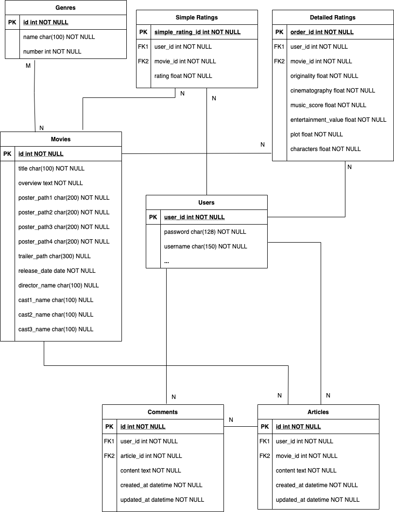

## 전체 프로젝트 공통 정리

---

### 팀원 정보 및 역할 분담

- 박성재: 백엔드
- 문준하: 프론트엔드

---

### 서비스 구현 목표 및 실제 구현 정도

#### 구현 완료

- 별점과 별개로 영화를 평가할 수 있는 지표 추가 도입(Hexa Rating)
- 간단한 추천 알고리즘
- JWT을 활용한 기본 로그인 구현
- 영화 평점 정보를 차트로 시각화
- Three.js를 활용한 3D 화면 구성
- 유저가 입력한 검색어에 따라서 실시간으로 관련 영화들을 보여주는 Search Bar 구현

#### 미구현

- 특정 영화에 대해서 함께 수다를 떨 수 있는 음성채팅 채널 구현

---

### 데이터베이스 모델링 (ERD)

---

### 필수 기능 설명

- 관리자 페이지를 통해 영화 추가 / 수정 / 삭제 가능
- 로그인 한 유저만 영화에 대한 평점을 등록 / 수정 / 삭제 가능하도록 인증 및 권한 구현
- 추천 알고리즘:
  - 로그인한 유저의 경우: 자신이 높게 평가한 상위 영화들 중 가장 많은 장르가 무엇인지 추출. 그 장르의 영화들 중 아직 사용자가 보지 않은 것들로 필터링하여 평균 별점 상위 영화 순으로 추천
  - 로그인하지 않은 경우: 평균 별점 상위 영화순으로 추천
- 영화 상세 페이지 및 커뮤니티:
  - 영화 평점 및 상세정보 제공
  - 해당 영화에 등록된 리뷰 (게시글 및 세부 항목별 평가 내역) 목록 표시
  - 해당 리뷰에 달린 댓글 확인 및 추가 / 수정 / 삭제 가능
  - 리뷰 및 댓글 작성은 로그인 필수, 수정 및 삭제는 본인의 것만 가능
